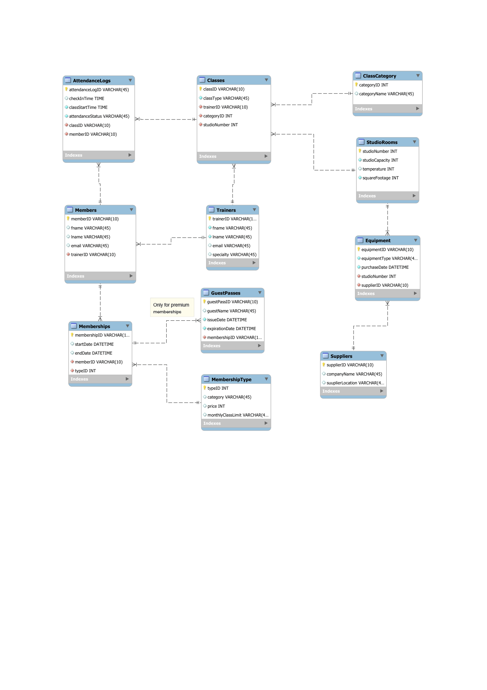
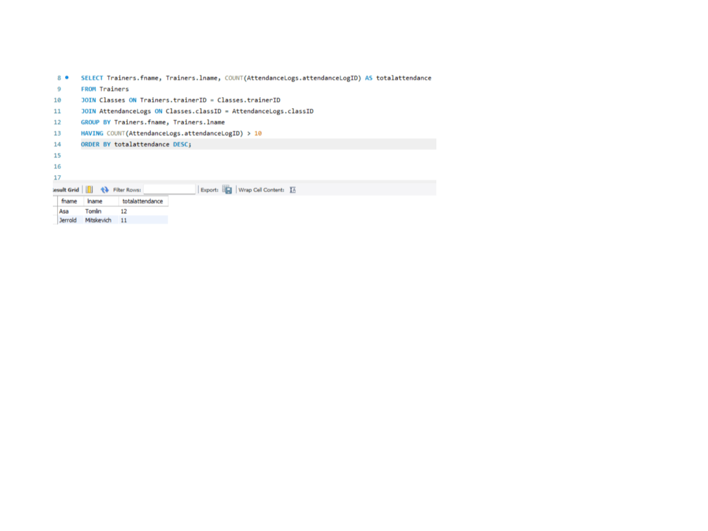

# Team 5 Mist 4610 Group Project 1

## Team Name

71552 Group 5
##  Team Members:

1. Brian Michaels
2. Kush Konduru
3. Peirece Jennnings
4. Simran Kansara
5. Rohan Reddy

## Problem Description: 

## Data Model

Our model is designed around the operations of a boutique fitness studio. The Members entity represents all individuals enrolled in the studio, and each member is linked to a Memberships record, which tracks their active plan, duration, and type. Memberships are further defined by the MembershipType entity, which specifies details such as pricing and class limits. Certain memberships also allow access to GuestPasses, which are associated with a specific membership and enable guests to attend classes.

The Classes entity represents all scheduled fitness sessions offered by the studio. Each class is associated with a Trainer, creating a one-to-many relationship since one trainer can lead multiple classes. Classes are also categorized using the ClassCategory entity to organize different types of workouts. Additionally, each class is assigned to a StudioRooms location, where room attributes such as capacity and size determine how many members can attend.

To track participation, the AttendanceLogs entity connects Members and Classes, recording check-in times, class start times, and attendance status. This allows the studio to monitor attendance behavior, including no-shows and participation trends.

On the operational side, the model includes Equipment and Suppliers. Equipment is assigned to specific studio rooms and sourced from suppliers, forming relationships that help track inventory and maintenance. Suppliers provide equipment to the studio, establishing a one-to-many relationship between suppliers and equipment.

Overall, this data model captures both the customer-facing and operational aspects of the fitness studio, enabling the system to support membership management, class scheduling, attendance tracking, and resource management.
## Data Dictionary:
## Queries: 

## Database information: